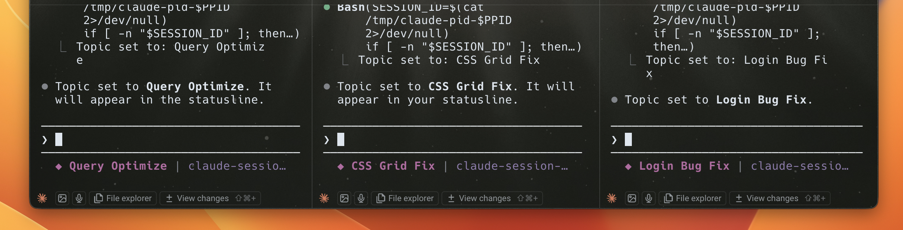

# claude-session-topics

Session topics for Claude Code. Auto-detect and display a topic in the statusline, change anytime with `/set-topic`.



## Install

```bash
npx @alexismunozdev/claude-session-topics
```

## With color

```bash
npx @alexismunozdev/claude-session-topics --color cyan
```

Supported colors: `red`, `green`, `yellow`, `blue`, `magenta` (default), `cyan`, `white`, `orange`, `grey`/`gray`. Raw ANSI codes are also accepted (e.g., `38;5;208`).

## What it does

- After Claude's first response, a Stop hook extracts a 2-5 word topic from your first message using YAKE keyword extraction (no model tokens spent)
- The auto-topic skill refines the topic when the conversation shifts
- Shows the topic in the Claude Code statusline (`◆ Topic`)
- Change the topic anytime with `/set-topic`
- Composes with existing statusline plugins (doesn't overwrite)

## What the installer configures

1. Copies the statusline script to `~/.claude/session-topics/`
2. Installs the Stop hook (`auto-topic-hook.sh`) that sets the initial topic
3. Configures `statusLine` in `~/.claude/settings.json`
4. Adds bash permission for the script
5. Installs `auto-topic` and `set-topic` skills to `~/.claude/skills/`
6. If you already have a statusline, creates a wrapper that shows both

## Requirements

- `jq`
- `bash`
- Python 3
- POSIX-compatible system (macOS, Linux)

**Note:** Python dependencies (YAKE for keyword extraction, langdetect for language detection) are installed automatically during setup. If automatic installation fails, the plugin falls back to reduced functionality and displays instructions for manual installation.

## Customization

The default topic color is bold magenta. Three ways to change it:

- Re-run with `--color <name>`:
  ```bash
  npx @alexismunozdev/claude-session-topics --color cyan
  ```
- Edit the config file directly:
  ```bash
  echo "cyan" > ~/.claude/session-topics/.color-config
  ```
- Set the `CLAUDE_TOPIC_COLOR` environment variable:
  ```bash
  export CLAUDE_TOPIC_COLOR="cyan"
  ```

## Usage

### Auto-topic (automatic)

After Claude's first response, a Stop hook extracts a 2-5 word topic from your first message using YAKE keyword extraction (no model tokens spent). The auto-topic skill then monitors the conversation and updates the topic when you shift to a different subject.

### /set-topic (manual)

Change the topic at any time:

```
/set-topic Fix Login Bug
/set-topic API Redesign
```

## How it works

```
Session starts
    |
Claude sends first response
    |
Stop hook (auto-topic-hook.sh) extracts topic from first user message
    |
Writes topic to ~/.claude/session-topics/${SESSION_ID}
    |
auto-topic skill monitors for conversation shifts and updates topic
    |
Statusline script reads the topic file → displays: ◆ Topic
```

The Stop hook runs after each model response and uses YAKE (Yet Another Keyword Extractor) to extract the initial topic from the transcript. YAKE is a lightweight, unsupervised keyword extraction algorithm that provides better results than simple bag-of-words approaches. If YAKE is not available, it falls back to a legacy heuristic method. On subsequent messages, the auto-topic skill handles topic updates when the conversation shifts. The statusline script receives the session ID via stdin JSON, reads the corresponding topic file, and renders it with ANSI color codes.

## Uninstall

```bash
npx @alexismunozdev/claude-session-topics --uninstall
```

## License

MIT
